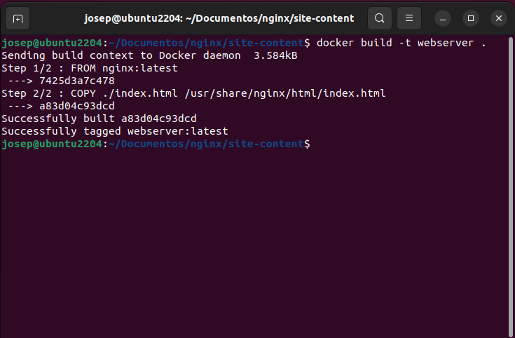

# SERVIDOR NGINX EN CONTENEDOR DOCKER

## Sistemas Informáticos - DAW1

### Josep Maria Castell Colom

---

## Instalación

1. El primer paso es comprobar que Docker funciona correctamente.  
   Para ello usaremos el comando:

   ```docker
   docker run hello-world
   ```

   Si obtenemos el resultado mostrado en la siguiente imagen significa que Docker está instalado en nuestro sistema y se encuentra en funcionamiento.

     

2. El segundo paso es ejecutar la imagen de NGINX (`nginx`) con el comando:

   ```docker
   docker run --rm -d -p 8080:80 --name web nginx
   ```

   Esto descargará la imagen de NGINX, la ejecutará como demonio (`-d`) publicada en el puerto 8080 (`-p 8080:80`) y la nombrará _web_ (`--name web`).

    

3. Si abrimos nuestro navegador e introducimos la URL `http://localhost:8080` veremos la página de bienvenida de NGINX.

   

   ***

## Personalizar HTML

1. Para empezar debemos parar el contenedor usando el comando:

   ```docker
   docker stop web
   ```

2. A continuación debemos crear nuestro archivo HTML en un directorio, por ejemplo, `/nginx/site-content`.

   

   Introducimos el contenido que consideremos oportuno:

   

3. Para que el contenedor de Docker muestre nuestra página _index.html_ debemos crear un volumen y montar nuestro directorio local (`~/nginx/site-content`) en el contenedor en ejecución.

   > El directorio en el que por defecto Nginx busca la página principal es `/usr/share/nginx/html`.

   Para ello usaremos el comando:

   ```docker
   docker run --rm -d -p 8080:80 --name web -v ~/Documentos/nginx/site-content:/usr/share/nginx/html nginx
   ```

4. Si a continuación accedemos de nuevo a `http://localhost:8080` veremos el siguiente resultado:

   

---

## Crear una imagen personalizada

Una imágen personalizada nos sirve para mover nuestros archivos juntamente con la imagen.

1. Para crear una imagen debemos añadir en el directorio anterior un archivo llamado Dockerfile con la siguiente información:

   ```docker
   FROM nginx:latest
   COPY ./index.html /usr/share/nginx/html/index.html
   ```

   > El comando `FROM` indica cual es la imagen base (en este caso la última imagen de NGINX) que nos servirá para contruir sobre ella nuestra imagen personalizada.  
   > Ell comando `COPY` copia nuestro archivo local `./index.html` a la ruta de la imagen `/usr/share/nginx/html/index.html`.

2. En este punto, si ejecutamos el siguiente comando se construirá nuestra imagen usando los comandos del archivo Dockerfile:

   ```docker
   docker build -t webserver .
   ```

   

3. Si ahora ejecutamos nuestra imagen en contenedor ya no necesitamos montar el volumen ya que se utiliza la información contenida en el Dockerfile.

   > Primero debemos detener el contenedor anterior. `docker stop web`

   ```docker
   docker run --rm -d -p 8080:80 --name web webserver
   ```

   Si accedemos a `http://localhost:8080` vemos nuestra página web.

   
